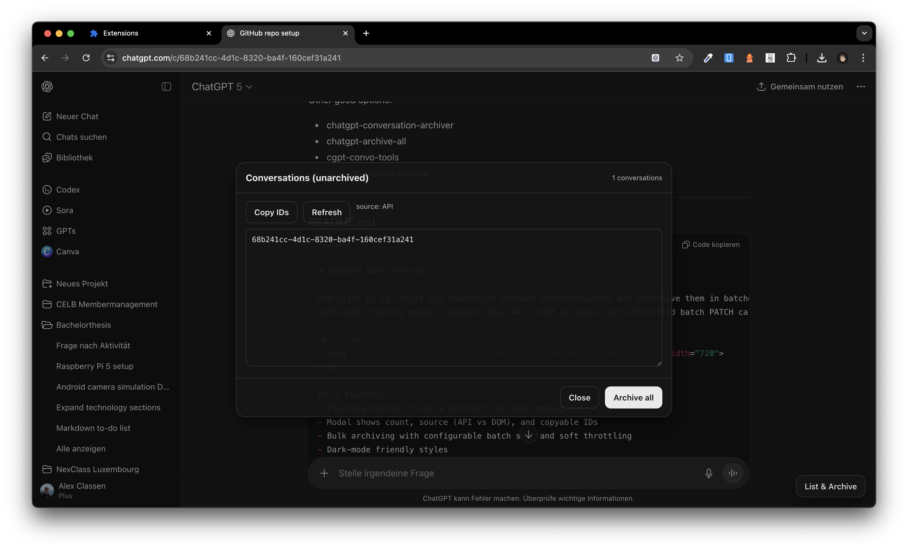

# ChatGPT Bulk Archiver

This extension adds a small button to ChatGPT that allows you to list all unarchived conversations and archive them in bulk.  

## Installation in Google Chrome

1. Download or clone this repository to your computer.  
2. Open Chrome and go to `chrome://extensions/`.  
3. In the top right, enable **Developer mode**.  
4. Click **Load unpacked**.  
5. Select the folder containing the extension files (where `manifest.json` is located).  
6. Open [https://chat.openai.com](https://chat.openai.com). You will see a **“List & Archive”** button in the bottom-right corner.  
7. Click the button to open the panel, where you can copy conversation IDs or archive all conversations.  

---

## 📄 Privacy Policy

**Effective Date:** September 2025  

### Overview  
ChatGPT Bulk Archiver is a Chrome extension designed to help users **save and archive their ChatGPT conversations** for personal backup and reference.  

We value your privacy. This extension does **not** collect, transmit, or share personal information with third parties. All processing is done locally on your device.  

### Data Collection & Usage  
- **Conversation Data**  
  - Archived chats are stored locally in your browser’s storage or downloaded directly by you.  
  - We do **not** send your data to any external servers.  

- **Permissions Justification**  
  - **Host permissions:** Needed to access ChatGPT pages in order to read conversation data.  
  - **Storage:** Used to save extension settings and archived chats locally.  
  - **webRequest / webRequestBlocking:** Used to detect ChatGPT network requests so the extension can identify and process conversations.  
  - **No remote code:** The extension does not load or execute code from external sources.  

### Third Parties  
We do not use third-party analytics, tracking, or advertising frameworks.  

### Your Data  
All your data remains **under your control**. You can delete archives at any time by clearing your browser storage.  